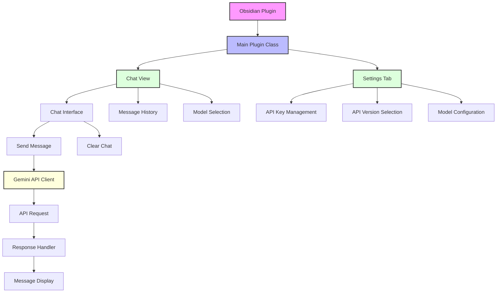

# Aidian Architecture

## Overview

Aidian is a plugin that integrates Google's Gemini AI into the note-taking environment. The plugin provides a chat interface that allows users to interact with Gemini AI models, with support for both v1 and v1beta API versions.

## Architecture Diagram

## Component Description

### 1. Main Plugin Class (`main.ts`)
- Initializes the plugin
- Manages plugin lifecycle
- Handles settings persistence
- Creates and manages views

### 2. Chat View (`ChatView`)
- Manages the chat interface
- Handles message history
- Controls model selection
- Manages chat state

### 3. Settings Tab (`AidianSettingTab`)
- Manages API key configuration
- Handles API version selection
- Controls model preferences
- Persists user settings

### 4. Gemini API Client
- Manages API communication
- Handles request/response flow
- Supports multiple API versions
- Manages error handling

## Data Flow

1. **Initialization**
   - Plugin loads and initializes settings
   - Creates chat view and settings tab
   - Loads saved configuration

2. **Chat Interaction**
   - User enters message
   - Message is sent to Gemini API
   - Response is received and displayed
   - Chat history is updated

3. **Settings Management**
   - User updates settings
   - Changes are persisted
   - Configuration is applied

## Key Features

### 1. Multi-API Support
- Supports both v1 and v1beta Gemini API versions
- Configurable through settings
- Seamless version switching

### 2. Model Selection
- Multiple model options
- Dynamic model loading
- Version-specific model support

### 3. Chat Interface
- Clean, modern design
- Message history management
- Clear chat functionality
- Markdown support

### 4. Settings Management
- Secure API key storage
- Persistent configuration
- User-friendly interface

## Security Considerations

1. **API Key Management**
   - Secure storage in plugin settings
   - No exposure in logs or UI
   - Optional key persistence

2. **Data Handling**
   - Local message storage
   - No external data sharing
   - Secure API communication

## Future Considerations

1. **Potential Enhancements**
   - Context-aware chat
   - Note content integration
   - Advanced model features
   - Custom prompt templates

2. **Scalability**
   - Modular architecture
   - Extensible design
   - Easy feature addition

## Development Guidelines

1. **Code Organization**
   - Clear component separation
   - Consistent naming conventions
   - TypeScript type safety

2. **Documentation**
   - Code comments
   - Architecture documentation
   - User guides 